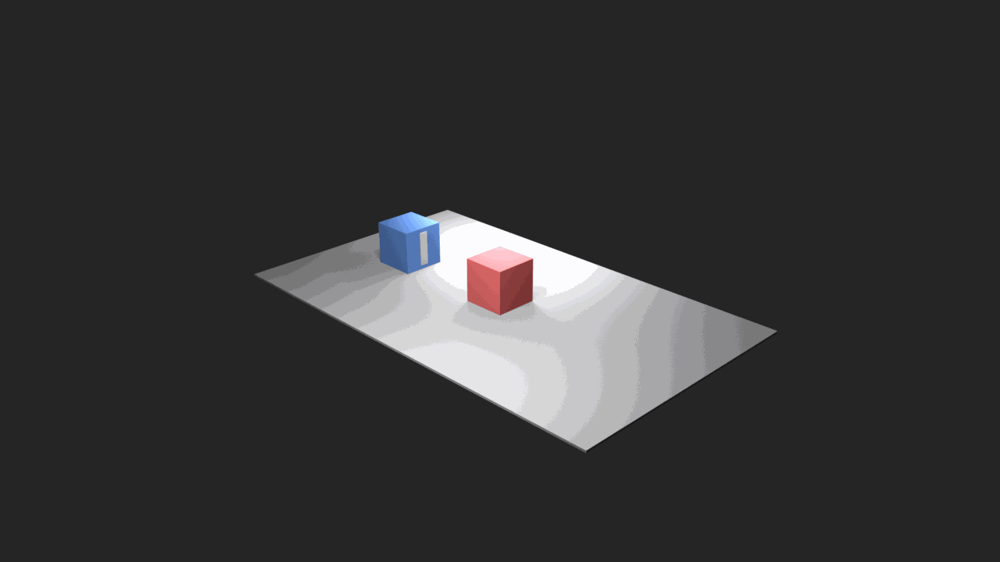
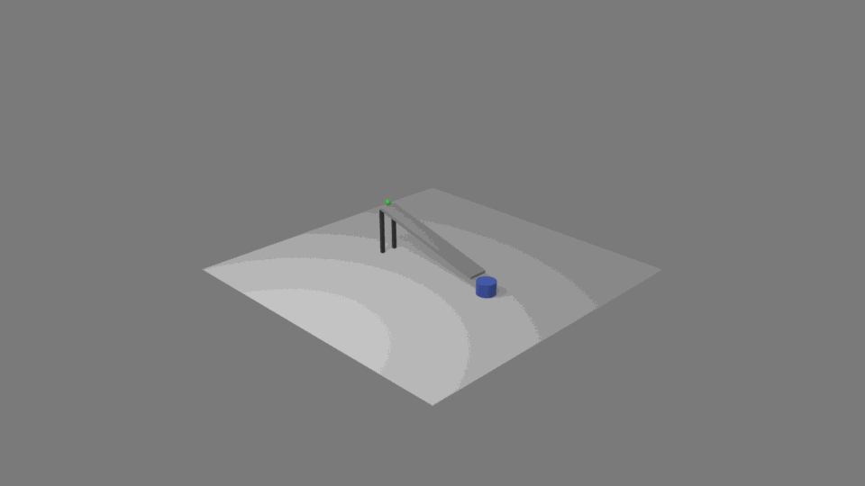

<!-- .slide: class="title-slide" -->

:::{kicker}
第 1 组 / Wang Siyu, Du Yuheng, Yang Tingyi, Tong Mingyang
:::

# VeriAnim: Verifiable LLM 3D Animation Generation with Blender Programs

:::{subtitle}
从自然语言到自动验证的 Blender 动画生成智能体
:::

---

# 需要解决的问题

:::{split-emphasis}
静态 3D 生成需要解决场景的美观程度、静态的合理性；但动画还要解决哪个物体（含摄像机）在什么时候动、接触和支撑是否合理、状态变化是否发生、镜头视线是否不被遮挡。
:::

- 直接生成 Blender 关键帧很容易只满足起点和终点的正确性。
- 中间帧可能穿模、悬空、把相机转到看不见动作的位置，只有最终帧正确。
- 这些问题的原因在于：此类约束往往并不能被用户语句所包含，它必须通过进一步分析用户需求后得出。

---

# 我们的目标

[columns]
[column]
:::{card}
**输入**
- 一段自然语言 prompt 描述场景+动画
- 目标是一个场景/动画
:::
[/column]

[column]
:::{card}
**输出**
- Blender 可运行的 Python script
- 场景图 / 变换轨迹
- 截图 / 预览视频
- 自动验证报告 / 修正记录
:::
[/column]
[/columns]

:::{callout}
与 transformer-diffusion（Seedance 等模型）不同，目标不是“生成一个视频”，而是生成一个可检查、可修复的“动画描述程序”。
:::

---

# 核心想法：两层 IR

[columns]
[column]
:::{card}
**1. SceneSpec IR**
- 静态场景作为基础
- 各个对象的 ID / 有自由度的独立部位 / 材质
- 对象之间关系 / 摄像机 / 碰撞 proxy
- 计划怎样验证合理性？应该满足怎样的约束？
:::
[/column]

[column]
:::{card}
**2. Animation Extension Contract**
- 在静态基础上上添加时间
- 事件窗口 / 动画类型
- 验证探针 / 能力画像
- 媒体证据 / 修复范围
:::
[/column]
[/columns]

---

# 系统流程

:::{pipeline}
:::{card}
**1. Plan**
prompt -> SceneSpec IR + 动画扩展
:::

:::{card}
**2. 构建静态场景**
生成对象、材质、灯光、相机，并先验证静态场景
:::

:::{card}
**3. 添加动画**
引用 object IDs，写关键帧 / 辅助函数 / 媒体采样
:::

:::{card}
**4. 验证与修复**
几何检查 + 视觉/视频检查 + 有边界的局部修复
:::
:::

:::{callout}
先构建静态场景，在静态验证通过后，动画阶段引用静态场景中的物体加关键帧；这样在修复动画问题时确保避免改动物体模型本身。
:::

---

# SceneSpec IR 做什么

- 把 prompt 中的对象、部件、材质、空间关系、相机和评估计划显式化。
- 每个对象有稳定 `verianim_id`，后续代码、采样、验证和修复都用同一套 ID。
- 空间关系检查要求的描述比较详细，并不仅仅类似“杯子在桌上”，需要明确如何检查 支撑 / 包含 / 附着 关系。
- 碰撞 proxy 让几何验证可以在 Blender 执行后通过基于规则的方法测量。

:::{metric}
**思想**
动画生成并非直接由prompt得到场景。本项目是 prompt -> IR -> 动画约束 -> 场景。使得场景可反复由约束进行修改。
:::

---

# Animation Extension 做什么

[columns]
[column]
:::{card}
**动画类型**
- 刚体运动
- 相机运动
- 可见性改变
- 变形
:::
[/column]

[column]
:::{card}
**验证证据**
- bbox / BVH / 接触检测
- 摄像机覆盖报告
- 截图和视频
- 变形统计
:::
[/column]

[column]
:::{card}
**运行能力说明**
- 完整支持的执行路径
- 降级执行 / 能力画像
- 暂不支持范围报告
:::
[/column]
[/columns]

:::{callout}
原则：每一种动画类型都必须说明它靠什么证据被验证。
:::

---

# 其他动画类型的实现

[columns]
[column]
:::{card}
**相机事件**
- 把相机当成会运动的主体
- `camera_move` / `camera_orbit`
- 检查终点、覆盖率、目标可见性
:::
[/column]

[column]
:::{card}
**可见性 / 状态变化**
- `appear` / `disappear`
- 显式设置 `hide_render` / alpha 的关键帧
- 关系检查切到对象真正可见的帧
:::
[/column]
[/columns]

[columns]
[column]
:::{card}
**变形原型**
- Blender 内可执行的 shape/scale 形变
- 采样 bbox delta / displacement spread
- 视频验证器判断形变是否可见
:::
[/column]

[column]
:::{card}
**角色 / 流体能力画像**
- 骨架 / IK / 动作捕捉意图
- 粒子 / 体积 / 缓存探针
- 当前先报告运行范围，而不是伪装成刚体动画
:::
[/column]
[/columns]

:::{callout}
刚体 primitive 是目前最成熟的一类，但不是整个系统的能力上限。
:::

---

# 目前最成熟的动画类型：刚体 primitive

- **支撑运动**：滑动、落到支撑面、沿支撑物移动。
- **成对交互**：推、携带、保持驱动体和载荷的相对位移。
- **抓取-放置**：接近、抓取、抬起、转移、放下、释放。
- **关节运动**：门轴、转子、绕有意义的轴转动。
- **组合规则**：每个帧窗口只有一个变换所有者，避免互相抢控制权。

---

# 验证与修复

[columns]
[column]
:::{card}
**规则检查**
- 支撑间隙与重叠
- 穿模
- 包含关系
- 变换所有权
- 密集帧检查
:::
[/column]

[column]
:::{card}
**媒体检查**
- 主体可见性
- 相机构图
- 时间顺序
- 可观察的最终状态
- 视频验证器反馈
:::
[/column]
[/columns]

:::{metric}
**修复策略**
用审核意见修改局部运动路径：例如重新计算物体底部和支撑面顶部的高度，而不是要求模型整段重写。
:::

---

# 我们已经实现了什么

- Blender 插件 socket 服务：执行脚本、检查场景、渲染截图和预览视频。
- Python 实验框架：规划器 / 代码生成器 / 修复器 / 视觉验证器 / 视频验证器。
- IR 解析与序列化：静态 SceneSpec + Animation Extension Contract。
- 规则验证器：几何关系、变换轨迹、帧窗口审计、变形统计。
- 动画类型：刚体、相机、可见性/状态、变形原型、角色/流体能力画像。
- 材质解析器：允许智能体联网搜索纹理。
- KV Cache 优化：提升多轮 refine 时的上下文复用效率。
- pip 安装包：发布 harness CLI，用户可通过 `pip install verianim` 安装。
- VeriAnim-AnimBench：300 条 prompt，easy / medium / hard 各 100。

---

# 遇到的问题

[columns]
[column]
:::{warning}
**穿模仍然最常见**
- 运动过程中间物体穿过另一物体
- 使用 bbox 判定对凹形物体不够精确
- 稀疏采样容易漏掉短暂接触错误
:::
[/column]

[column]
:::{warning}
**如果模型能力差，则难以自我更正**
- 反复修正仍然改不到失败原因
- 破坏那些没有错误的、已有的东西
- 会尝试“解释”错误，而不是修复
:::
[/column]
[/columns]

---

<!-- .slide: class="iteration-wall-slide" -->

# parallel_gripper_pick_place：16 轮完整迭代过程

:::{iteration-grid}
:::{iteration-cell}
{.iteration-gif}
:::
:::{iteration-cell}
{.iteration-gif}
:::
:::{iteration-cell}
{.iteration-gif}
:::
:::{iteration-cell}
{.iteration-gif}
:::
:::{iteration-cell}
{.iteration-gif}
:::
:::{iteration-cell}
{.iteration-gif}
:::
:::{iteration-cell}
{.iteration-gif}
:::
:::{iteration-cell}
{.iteration-gif}
:::
:::{iteration-cell}
{.iteration-gif}
:::
:::{iteration-cell}
{.iteration-gif}
:::
:::{iteration-cell}
{.iteration-gif}
:::
:::{iteration-cell}
{.iteration-gif}
:::
:::{iteration-cell}
{.iteration-gif}
:::
:::{iteration-cell}
{.iteration-gif}
:::
:::{iteration-cell}
{.iteration-gif}
:::
:::{iteration-cell}
{.iteration-gif}
:::
:::

---

# 展示样例

[columns]
[column]
:::{showcase-card}
{.showcase-gif}
**collision_two_cubes**

- Prompt: `A physical experiment: a moving square hits a stationary square. The same mass, no energy loss, no friction.`
- 结果：蓝色方块在接触处停止；红色方块向右离开。
- 证据：规则验证 + 场景视觉验证 + 动画视频验证均通过。
:::
[/column]
[column]
:::{showcase-card}
{.showcase-gif}
**marble_run_into_cup**

- Prompt: `marble rolls down a supported ramp and stops inside a blue catch cup.`
- 结果：斜坡、支撑物和杯子保持固定；弹珠运动和最终包含关系可见。
- 证据：场景保持 + 规则验证 + 动画视频验证均通过。
:::
[/column]
[column]
:::{showcase-card}
{.showcase-gif}
**完整展示页**

- 扫码查看更多 VeriAnim showcase。
- 包含场景图片、动画预览、源 prompt 和验证结果。
:::
[/column]
[/columns]

:::{muted}
更多展示样例请查看二维码。
:::

---

# 基准测试：refine 轮数作为大模型评测指标

:::{metric}
**观察**

注意到不同模型的能力在可执行动画生成上的差异，经常体现在需要多少轮局部修复。refine 轮数因此可以作为 AnimBench 的指标之一。
:::

- `0 rounds`：一次生成就满足几何和媒体证据。
- `1-2 rounds`：局部修复有效，说明合同和证据足够定位问题。
- `many rounds / stop`：通常对应弱模型、约束不足的 primitive、或验证器无法给出可操作证据。
- 我们正在把 refine 轮数和通过/问题数量指标一起纳入 AnimBench 评测。

---

# 基准测试设计：AnimBench 怎么测

[columns]
[column]
:::{card}
**prompt 分层**
- 300 条自然语言 prompt
- easy / medium / hard 各 100 条
- easy：单对象或单关系
- medium：两个协调事件或镜头要求
- hard：多物体组合、并行动作、family 混合
:::
[/column]

[column]
:::{card}
**覆盖的动画类型**
- 支撑运动 / 携带
- 抓取放置 / 操作
- 铰链 / 转子关节运动
- 相机运动 / 可见性变化
- 变形和混合场景
:::
[/column]
[/columns]

---

# 基准测试设计：对比什么

[columns]
[column]
:::{card}
**系统变体**
- 直接生成关键帧
- 只使用 IR
- 有动画扩展合同但没有 primitives
- 有 primitives 但没有修复
- 完整的验证器导向实验框架
:::
[/column]

[column]
:::{card}
**评测指标**
- 规则验证通过率
- 支撑 / 穿透违规率
- 最终关系成功率
- 主体可见性
- 视频验证器通过率
- refine 轮数和运行成本
:::
[/column]
[/columns]

:::{metric}
**核心问题**
合同、primitive、密集帧审计、媒体验证器、有边界修复分别带来多少可测收益？
:::

---

# AnimBench：easy / medium 示例

[columns]
[column]
:::{card}
**Easy / 刚体**

`Create a simple scene where a red ball slides from the left side of the table to the right side.`
:::
[/column]

[column]
:::{card}
**Easy / 可见性**

`Create a simple scene where a red ball moves behind a thin screen and reappears on the other side.`
:::
[/column]
[/columns]

[columns]
[column]
:::{card}
**Medium / 相机 + 刚体**

`Create an animation where the ball follows an S-shaped path around the blue box while the camera keeps both visible.`
:::
[/column]

[column]
:::{card}
**Medium / 刚体**

`Create an animation where a simple gripper picks up the ball, moves it to the blue box, and releases it cleanly.`
:::
[/column]
[/columns]

:::{callout}
easy 隔离单一对象或关系；medium 开始组合两个事件或加入相机要求。
:::

---

# AnimBench：hard / mixed 示例

[columns]
[column]
:::{card}
**Hard / 相机 + 刚体**

`The parallel gripper lifts the orange box from the gray conveyor belt, carries it to the cart, releases it, and the inspection camera keeps the handoff visible.`
:::
[/column]

[column]
:::{card}
**Hard / 变形 + 刚体**

`The parallel gripper carries the orange box past a deforming banner, places it on the cart, and the camera shows both motions.`
:::
[/column]
[/columns]

:::{warning}
由于时间原因，完整 300 条 benchmark 还没有全部跑完；当前展示的是 benchmark 设计、prompt 覆盖和精选展示样例审计。
:::

---

# 仍存在的问题与下一步

- 更精细的 mesh/BVH 检查，减少 bbox 对穿模的误判和漏判。
- 完整跑完 300 条 AnimBench，报告通过率、修复轮数和动画类型拆分。
- 扩展角色 / 流体运行适配器，而不仅是能力画像。
- 把“弱模型无法更正”的失败类型系统化，区分模型能力、证据质量和合同缺失。
- 将 AnimBench 推广为多模态模型的基准测试之一，报告通过率、违规率、refine 轮数和验证器分歧。

---

# 发布方式与项目分工

[columns]
[column]
:::{card}
**使用**
- `pip install verianim` 安装 Python harness CLI。
- Blender 4.5.4 LTS + VeriAnim 插件 socket 服务。
:::
[/column]

[column]
:::{card}
**组内分工**
- Wang Siyu：整体代码架构与实现、刚体动画 primitives、论文写作、项目协调。
- Du Yuheng：`verianim_utils` 动画 primitives 实现。
- Yang Tingyi：扩展 IR 与更多动画类型支持。
- Tong Mingyang：刚体动画、适配 KV Cache 的 prompt 优化、材质搜索、论文写作、slides 准备。
:::
[/column]
[/columns]
